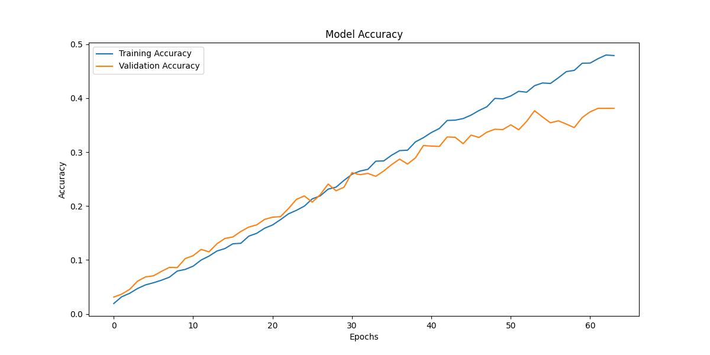
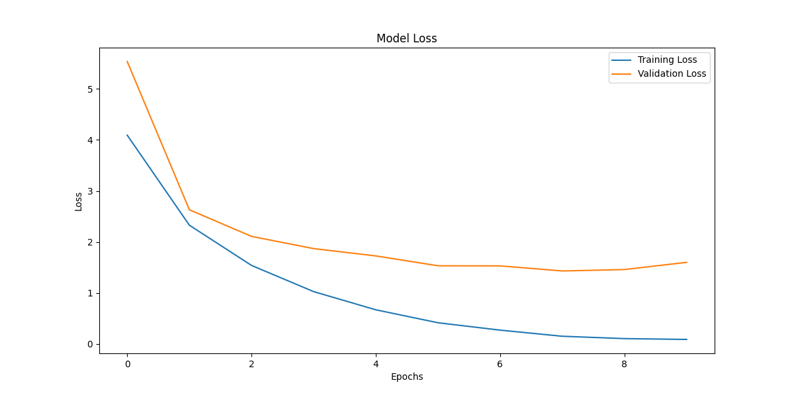
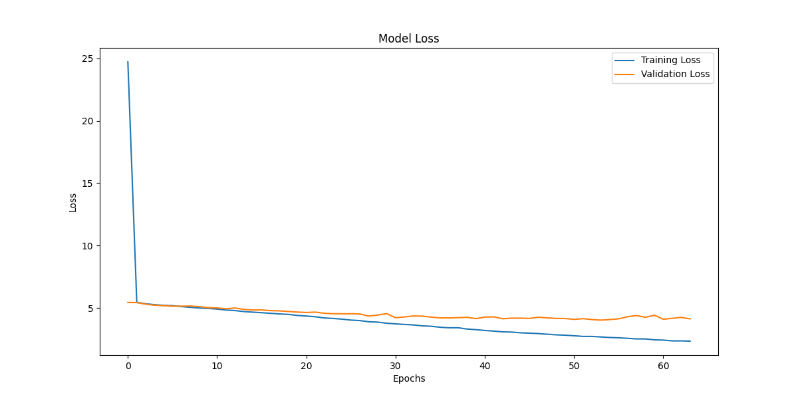
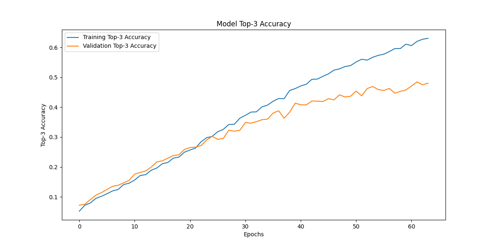
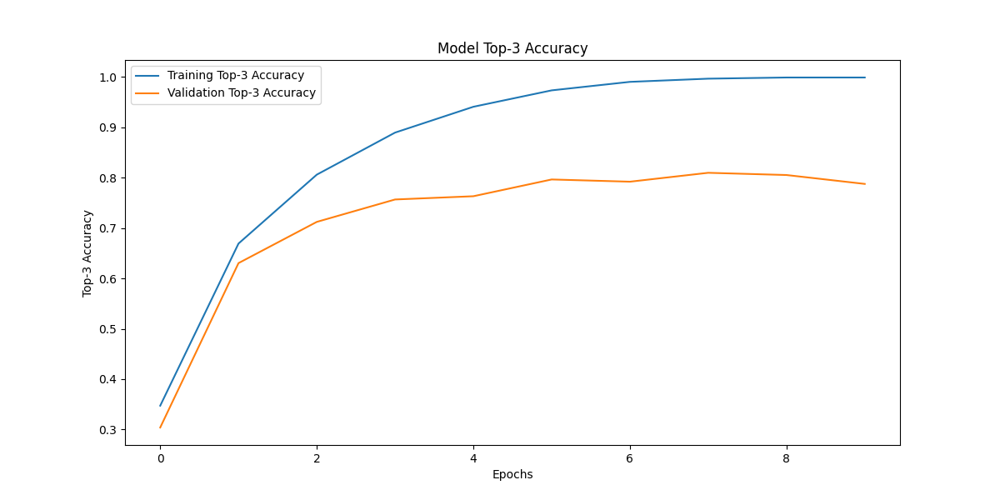

# E-Commerce Neural Networks

This project classifies product images into various subcategories using Convolutional Neural Networks (CNN) and a ResNet-50 model. It includes:

1. **Data Preparation**  
   - Loads saved NumPy arrays (`image_arrays_final.npy` and successful_indices_final.npy).  
   - Splits data into train/test sets, encodes labels, and prepares images.

2. **Models**  
   - **CNN**: A custom convolutional network defined in `build_cnn(num_classes)`.  
   - **ResNet-50**: A fine-tuned ResNet model defined in `build_resnet50_model(num_classes)`.

3. **Training**  
   - Run main.py directly to train models.  
   - Uses early stopping and exponential decay learning rates to improve performance.  
   - Saves checkpoints and final models (e.g., cnn_model.h5, resnet_model.h5).

4. **GUI**  
   - gui.py contains a Tkinter-based interface to load a PNG or JPEG image and classify it using a trained model.  
   - Loads a saved model (e.g., cnn_model.h5 or resnet_model.h5) without retraining.

5. **Usage**  
   - Clone the repo:  
     ```bash
     git clone https://github.com/MatasMartinkus/E-Commerce-Neural-Networks.git
     cd E-Commerce-Neural-Networks
     ```  
   - Install Python dependencies:  
     ```bash
     pip install -r requirements.txt
     ```  
   - Run training (only if needed):  
     ```bash
     python main.py
     ```  
   - Launch the GUI (with an already trained model):  
     ```bash
     python gui.py
     ```

6. **Methods**  
   - **Data Augmentation**: Random flips, rotations, and zoom applied to images during training.
   - **Class Balancing**: Custom split logic ensures balanced train/test sets across all subcategories.
   - **Learning Rate Scheduling**: Exponential decay reduces learning rate over time to fine-tune performance.
   - **Early Stopping**: Training terminates when validation loss stops improving, preventing overfitting.

7. **Results**  
   ### Model Performance
   | Model | Accuracy | Top-3 Accuracy | Dataset Size | Categories |
   |-------|----------|---------------|--------------|------------|
   | CNN   | 0.43     | ~0.65         | 14,414       | 285        |
   | ResNet50 | 0.64  | ~0.82         | 14,414       | 285        |

   ### Visual Analysis
   
   #### Training and Validation Metrics
   The project generates detailed visualizations in the cnn and resnet folders:
   
   - **Accuracy Curves**: Shows how both models improve over epochs, with ResNet50 reaching higher accuracy faster
     - View in  and 
   
   - **Loss Curves**: Demonstrates convergence patterns and potential overfitting
     - View in  and 
   
   - **Top-3 Accuracy**: Shows the models' ability to include correct labels within top 3 predictions
     - View in  and 
   
   #### Confusion Matrices
   - Normalized confusion matrices help identify which categories are most frequently confused
   - Brighter diagonal elements indicate better class-specific performance
   - View in Confusion_matrix_normalized.png and Confusion_matrix_normalized.png

8. **Notes**  
   - The code prevents re-training when imported in gui.py.  
   - Adjust file paths or parameters (e.g., `test_size`, `epochs`) to fit your own environment.
   - All image data was sourced from a single e-commerce platform for consistency.
   - ResNet50 significantly outperforms the custom CNN due to transfer learning benefits.

---

